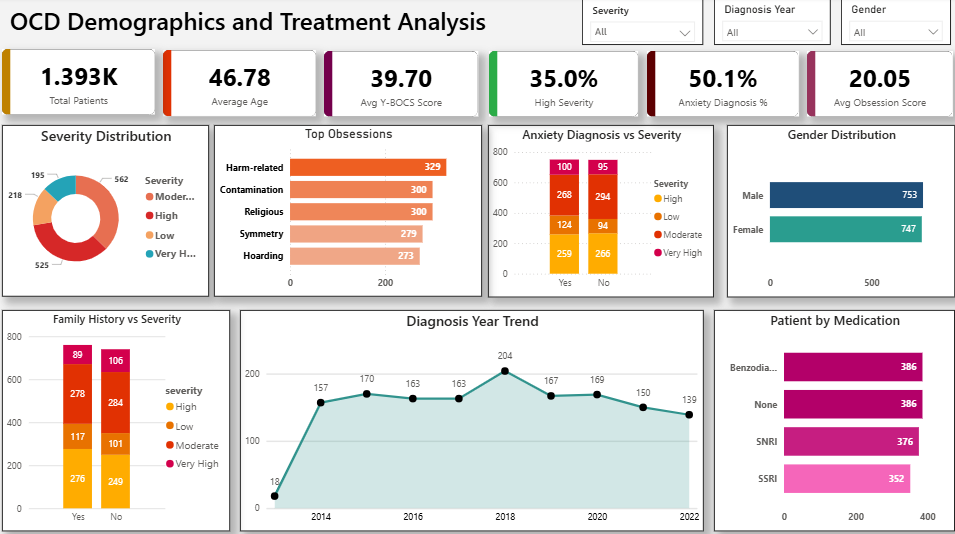

# OCD-patient-analysis
## 📌 Project Overview
The *OCD Data Analysis Dashboard* is a healthcare analytics project developed using *Python, SQL, Excel, and Power BI*.  
The project focuses on analyzing OCD patient data to identify trends, severity patterns, demographic insights, and diagnosis analysis through interactive dashboards and visual reports.

---

## 🛠️ Technologies Used
- 🐍 Python
- 🗄️ SQL
- 📊 Excel
- 📈 Power BI

---

## 📊 Key Features
- Data Cleaning & Processing
- SQL-Based Data Analysis
- Excel Reports & Pivot Tables
- Interactive Power BI Dashboard
- OCD Severity Analysis
- Gender & Age Group Insights
- Diagnosis Year Trends
- KPI & Visual Reports

---

## 📷 Dashboard Preview

> Add your dashboard screenshot in the repository and save it as *dashboard.png*

---

## 🎯 Project Objective
The main objective of this project is to analyze OCD patient data and generate meaningful insights using data analytics and visualization tools.

---

## 👨‍💻 Author
*Rakesh Kumar*
